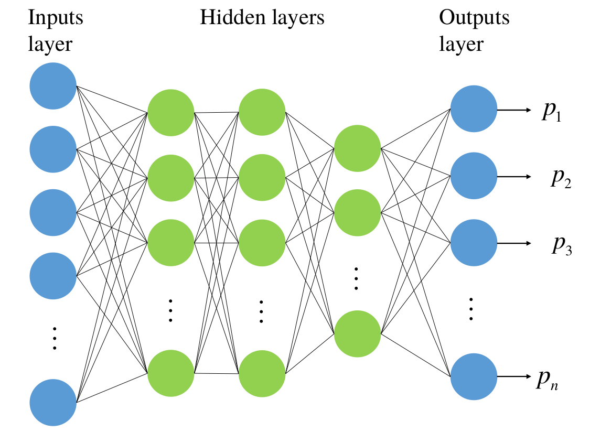
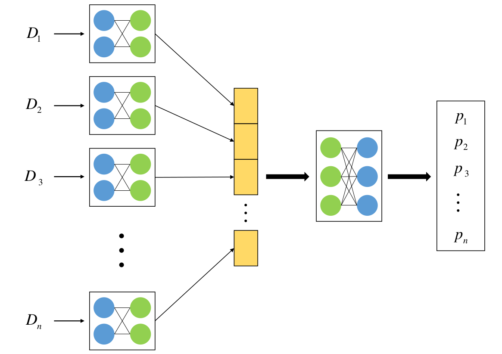
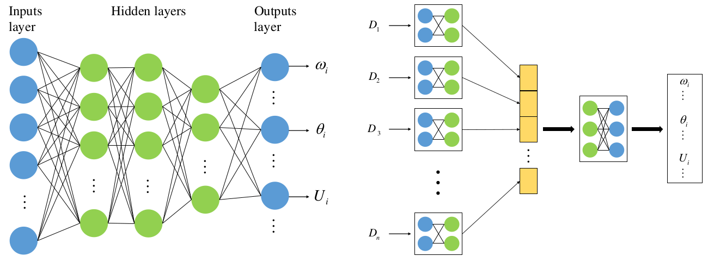
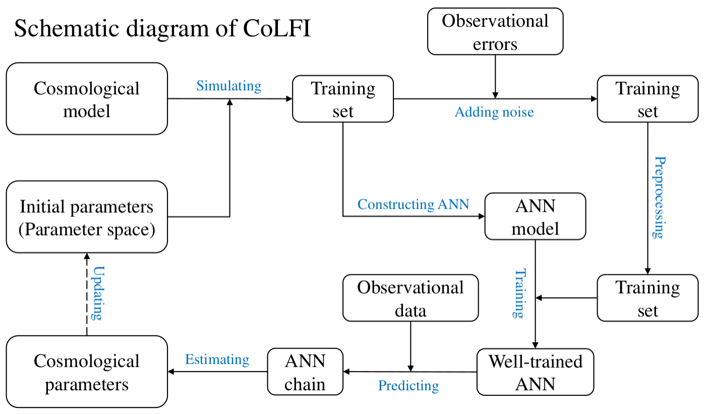
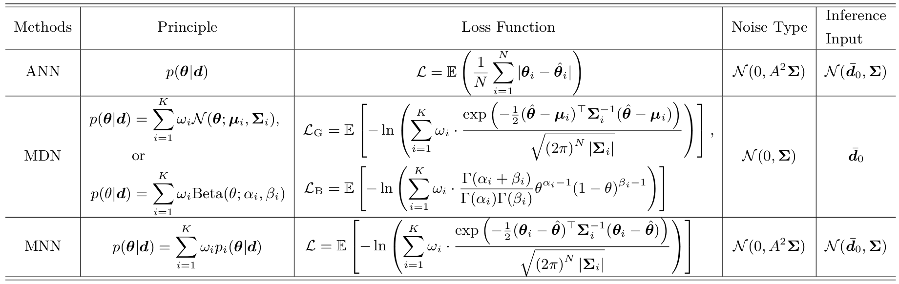

.. _introduction:

Introduction
************

CoLFI is designed to estimate parameters directly from the observational data sets using neural density estimators (NDEs), which is a fully ANN-based framework that is different from the Bayesian inference. There are three NDEs in CoLFI that can be used to estimate parameters, which are artificial neural network (ANN), mixture density network (MDN), and mixture neural network (MNN), respectively. It can learn the conditional probability density :math:`p(\boldsymbol\theta|\boldsymbol d)` using samples generated by models, and the posterior distribution :math:`p(\boldsymbol\theta|\boldsymbol{d}_0)` can be obtained for a given observational data :math:`\boldsymbol{d}_0`.

This part will briefly show you the basic principle of CoLFI, however, we recommend that readers read our published `ANN paper <https://arxiv.org/abs/2005.07089>`_, `MDN paper <https://arxiv.org/abs/2207.00185>`_, and `MNN paper <>`_ for more details.

ANN
===

An ANN, also called a neural network (NN), is a mathematical model that is inspired by the structure and functions of biological NNs, and it generally consists of an input layer, hidden layers, and an output layer (see Figure 1 below). 

The ANN, composed of linear and nonlinear transformations of input variables, has been proven to be a “universal approximator”, which can represent a great variety of functions. This powerful property of the ANN allows its wide use in regression and estimation tasks.

The ANN aims to make a mapping from the input data to the output data; thus, for the task of parameter inference, the ANN actually learns a mapping between the measurement and the corresponding cosmological parameters.

The general structure of ANN used to estimate parameters for one data set is shown in Figure 1 below, which is a single fully connected network with a few hidden layers and is usually called multilayer perceptron (MLP). The input is the measurement (or observational data), and the outputs are parameters to be concerned.
    

    
    Figure 1. General structure of an MLP (`Wang et al. (2020) <https://doi.org/10.3847/1538-4365/aba190>`_).

For multiple sets of data sets, multibranch network (see Figure 2 below) should be used to achieve a joint constraint on parameters. For a multibranch network, each branch can accept a set of data sets as inputs and combine the information in the hidden layers and output the corresponding cosmological (or theoretical) model parameters.

    Figure 2. General structure of a multibranch network (Wang et al. (2020)).
    
For the ANN method, the networks are optimized by minimizing the L1 loss function:

.. math::
	\mathcal{L} = \mathbb{E}\left( \frac{1}{N}\sum_{i=1}^{N}|\boldsymbol\theta_i - \hat{\boldsymbol\theta}_i| \right) .

MDN
===

An MDN is a combination of an ANN and a mixture model. The main idea of MDN is to model the posterior distribution via a mixture model and determine the mixture model using the neural network. Therefore, for measurement :math:`\boldsymbol{d}` and cosmological parameters :math:`\boldsymbol\theta`, the probability density of :math:`\boldsymbol\theta` with :math:`K` components has the form:

.. math::
	p(\boldsymbol\theta|\boldsymbol{d}) = \sum_{i=1}^K \omega_i p_i(\boldsymbol\theta|\boldsymbol{d}) .

Specifically, for MDN with Gaussian components, the probability density of :math:`\boldsymbol\theta` is

.. math::
	\nonumber p(\boldsymbol\theta|\boldsymbol{d}) &= \sum_{i=1}^K \omega_i\mathcal{N}(\boldsymbol\theta; \boldsymbol\mu_i, \boldsymbol\Sigma_i) \\
	&= \sum_{i=1}^K \omega_i\cdot\frac{\exp{\left( -\tfrac{1}{2} (\boldsymbol\theta - \boldsymbol\mu_i)^\top \boldsymbol\Sigma_i^{-1} (\boldsymbol\theta - \boldsymbol\mu_i) \right)}}{\sqrt{\left( 2\pi \right)^N |\boldsymbol\Sigma_i|}}~.

Therefore, the network in MDN aims to learn the parameters of the Gaussian mixture model (:math:`\omega, \boldsymbol\mu`, and :math:`\boldsymbol\Sigma`). The general structure of MDN are shown in Figure 3 below.

.. figure:: figures/mdn_multiBranchMDN.png
    :align: center
    :width: 96 %
    
    Figure 3. General structure of MDN (`Wang et al. (2022) <https://doi.org/10.3847/1538-4365/ac7da1>`_).

Then, the network can be optimized by minimizing the loss function:

.. math::
	\mathcal{L} = \mathbb{E}\left[ -\ln\left( \sum_{i=1}^K \omega_i \times \frac{\exp{\left( -\tfrac{1}{2} (\hat{\boldsymbol\theta} - \boldsymbol\mu_i)^\top \boldsymbol\Sigma_i^{-1} (\hat{\boldsymbol\theta} - \boldsymbol\mu_i) \right)}}{\sqrt{\left( 2\pi \right)^N |\boldsymbol\Sigma_i|}} \right) \right] ~.

Besides, Beta distribution is also considered in CoLFI as components of MDN. A beta mixture model with :math:`K` components has the form

.. math::
	\nonumber p(\theta|\boldsymbol{d}) &= \sum_{i=1}^K \omega_i {\rm Beta}(\theta; \alpha_i, \beta_i) \\
	&= \sum_{i=1}^K \omega_i \cdot \frac{\Gamma(\alpha_i+\beta_i)}{\Gamma(\alpha_i)\Gamma(\beta_i)} \theta^{\alpha_i-1} (1-	\theta)^{\beta_i-1} .

Then, the parameters of the beta mixture model can be estimated by minimizing the loss function

.. math::	
	\mathcal{L} = \mathbb{E}\left[ -\ln\left( \sum_{i=1}^K \omega_i  \times \frac{\Gamma(\alpha_i+\beta_i)}{\Gamma(\alpha_i)\Gamma(\beta_i)} \theta^{\alpha_i-1} (1-\theta)^{\beta_i-1}\right) \right] .

MNN
===

The basic principle of the MDN method is the assumption that the posterior distribution is a mixture of some unknown distributions, which then learns the mixture model using an ANN. Therefore, we should first get the parameters of the mixture model and then obtain the posterior distribution by generating samples based on the mixture model. However, for cosmological parameters that may deviate from Gaussian distribution, multiple components should be used to obtain the correct posterior distribution. This will take more time to train the network and also increase the instability of the network, which makes it difficult to learn the parameters of the mixture model.

Fortunately, the MNN method (Figure 4) can overcome these shortcomings. Similar to the ANN method, cosmological parameters can be output by the neural network in MNN directly. At the same time, the covariance information will be output by the network to ensure the output cosmological parameters has more accurate correlations. The loss function of MNN is similar to that of the MDN with Gaussian components:

.. math::
	\nonumber\mathcal{L} = \mathbb{E}\left[ -\ln\left( \sum_{i=1}^K \omega_i \times \frac{\exp{\left( -\tfrac{1}{2} (\boldsymbol\theta_i - \hat{\boldsymbol\theta})^\top \boldsymbol\Sigma_i^{-1} (\boldsymbol\theta_i - \hat{\boldsymbol\theta}) \right)}}{\sqrt{\left( 2\pi \right)^N |\boldsymbol\Sigma_i|}} \right) \right] ,

where the precision matrix :math:`\boldsymbol\Sigma^{-1}_i` can be characterized by its Cholesky factor :math:`\boldsymbol{U}_i`

.. math::
	\boldsymbol\Sigma^{-1}_i = \boldsymbol{U}^\top_i\boldsymbol{U}_i~.

    
    Figure 4. General structure of MNN (`Wang et al. (2023) <>`_).

Training and Parameter Estimation
=================================

The training process of CoLFI is shown in the schematic diagram below. The key steps of the training process are as follows:

1. Set initial parameters for cosmological parameters, which are intervals of parameters.

2. Build a cosmological model instance and pass it to CoLFI, and the training/validation set will be simulated automatically by using the instance.

3. Pass the errors of the observational data to CoLFI, and then random noise will be automatically added to the training/validation set. Furthermore, the training/validation set will be preprocessed.

4. After the training/validation sets are preprocessed, an ANN (MDN or MNN) model will be built automatically according to the size of the mock data.

5. Feed the training/valiation set to the network model, and the model will be well trained after thousands of epochs.

6. Feed the observational data to the well-trained network model, and then a chain of parameters will be produced.

7. Posterior distribution of parameters can be further obtained by using the chain. Then, the parameter space to be learned will be updated according to the posterior distribution of parameters.

    
    Figure 5. Schematic diagram of CoLFI. (`Wang et al. (2023) <>`_).

After several estimations, the burn-in phase will end, and the estimated parameters will reach stable values. Therefore, the ANN chains can be used to estimate cosmological parameters after the burn-in phase.

The following table shows a comparison of the ANN, MDN, and MNN methods. :math:`N` is the number of cosmological parameters. :math:`\hat{\boldsymbol\theta}` is the ground truth (i.e., the target) in the training set. :math:`\mathcal{L}_{\rm G}` is the loss function for the MDN with Gaussian components, and :math:`\mathcal{L}_{\rm B}` is the loss function for the MDN with Beta components. Inference input here refers to the input of the network when estimating parameters. :math:`\boldsymbol{d}_0` is the observational data.

    
    Table 1. Comparison of the ANN, MDN, and MNN methods. (`Wang et al. (2023) <>`_).

