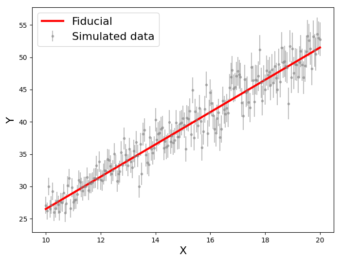
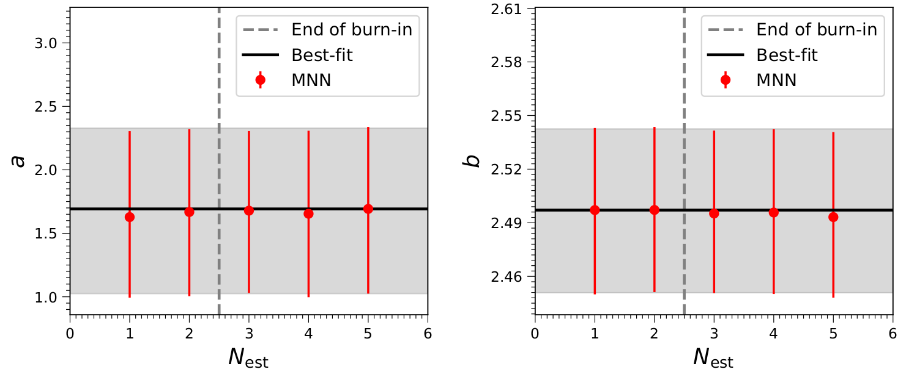
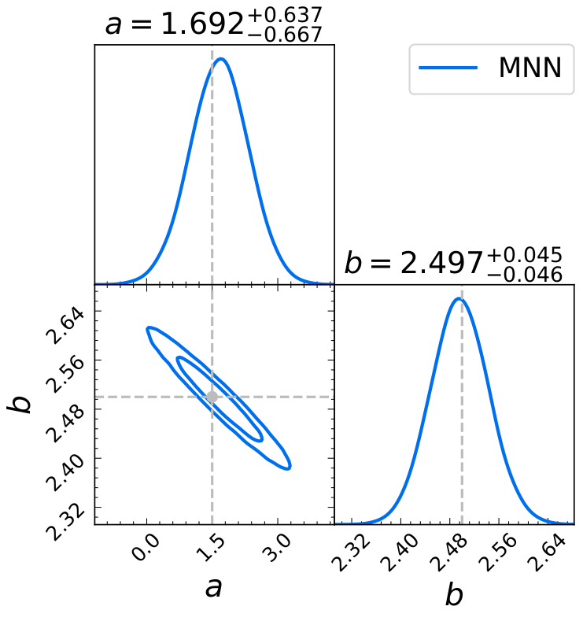
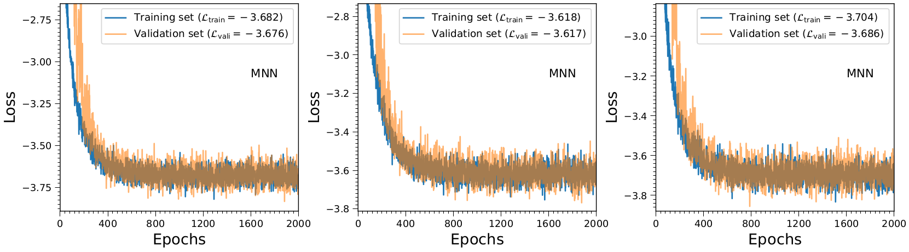
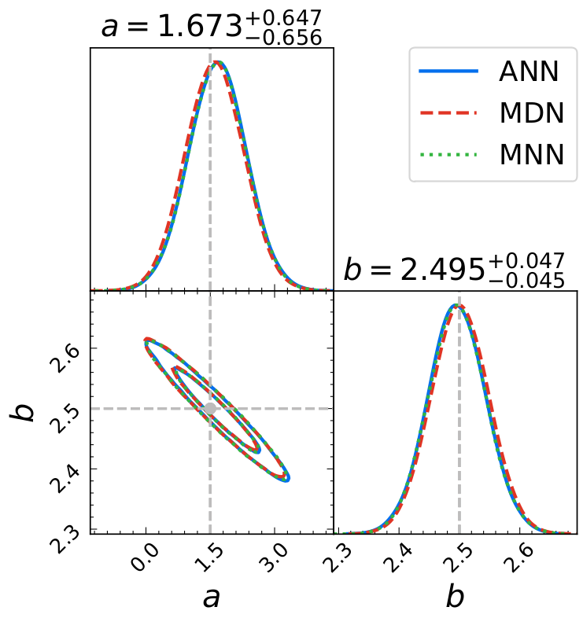
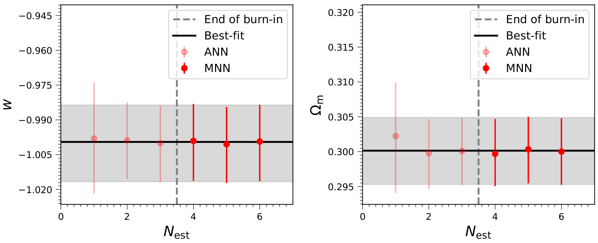
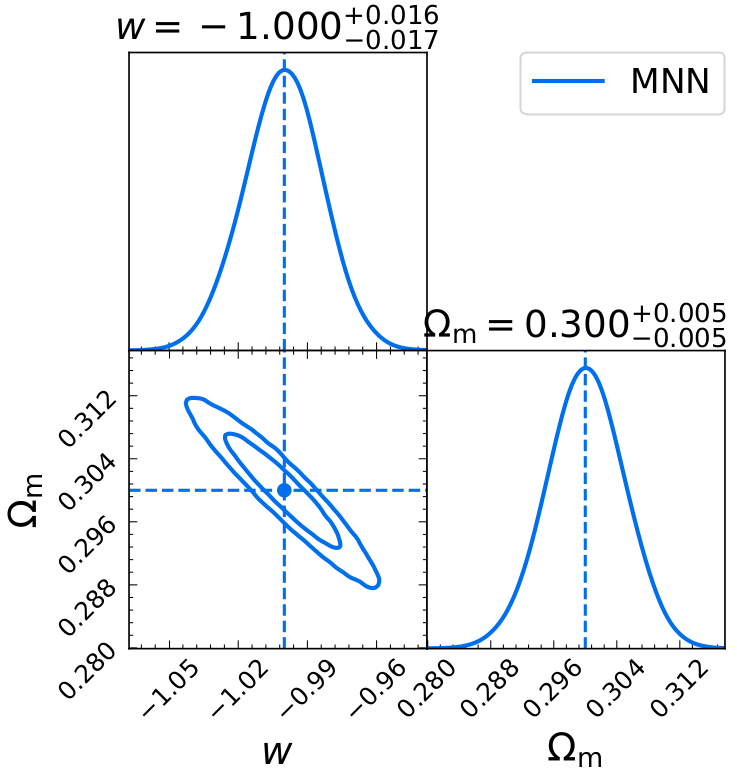
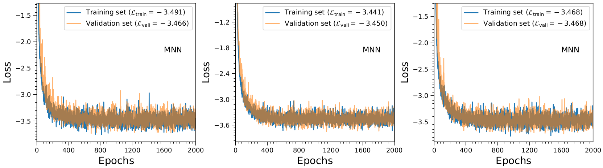

.. _quickStart:

Quick Start
***********

Here we show two examples to illustrate how CoLFI works, and the readers can archieve their project quickly by modifing the examples. The code used to generate these examples can be downloaded `here <https://github.com/Guo-Jian-Wang/colfi/tree/master/examples>`_.

Using one dataset
=================

The main process of using CoLFI includes preparing observational data and theoretical model, training the network, estimating parameters using the saved ANN chains or the well-trained network.

Let's consider a general case, the simple linear model:

.. math::
    y = a + b\times x

where `a` and `b` are two free parameters to be estimated, and `y` is the measurement. We first build a class object for this model::
    
    class SimLinear(object):
        def __init__(self, x):
            self.x = x
        
        def model(self, x, a, b):
            return a + b * x
    
        def sim_y(self, params):
            a, b = params
            return self.model(self.x, a, b)
    
        def simulate(self, sim_params):
            return self.x, self.sim_y(sim_params)

.. Note::
    The class object must contain a ``simulate`` method, which is used to simulate samples in the training process.

Then a data sample can be simulated as observational data, by using the function below::
    
    import colfi.nde as nde
    import numpy as np
    import matplotlib.pyplot as plt
    
    def get_data(x, a_fid, b_fid, random=True):
    	np.random.seed(5)
        y_th = SimLinear(x).sim_y([a_fid, b_fid])
        err_y = y_th * 0.05
        if random:
            y = y_th + np.random.randn(len(x))*err_y
        else:
            y = y_th
        sim_data = np.c_[x, y, err_y]
        return sim_data, y_th
    
    randn_num = np.random.randn()
    
    a_fid, b_fid = 1.5, 2.5
    x = np.linspace(10, 20, 201)
    sim_data, y_th = get_data(x, a_fid, b_fid)
    
    plt.figure(figsize=(8, 6))
    plt.errorbar(x, sim_data[:,1], yerr=sim_data[:,2], fmt='.', color='gray', alpha=0.5, label='Simulated data')
    plt.plot(x, y_th, 'r-', label='Fiducial', lw=3)
    plt.xlabel('X', fontsize=16)
    plt.ylabel('Y', fontsize=16)
    plt.legend(fontsize=16)

After that, we can build a model instance and make some settings for parameter initialization::

    model = SimLinear(x)
    params_dict = {'a' : [r'$a$', np.nan, np.nan],
                   'b' : [r'$b$', 0, 10]}
    param_names = [key for key in params_dict.keys()]
    init_params = np.array([[0, 5], [1, 3]])

where ``params_dict`` is a dictionary that contains information of the parameters, which include the labels and physical limits, and ``init_params`` is the initial settings of the parameter space.

.. Note::
    If the physical limits of parameters (the minimum and maximum values) is unknown or there is no physical limits, it should be set to
    ``np.nan``.

Finally, we can build a predictor and pass the data and model instance to it to train the network::

    # nde_type = 'ANN'
    # nde_type = 'MDN'
    nde_type = 'MNN'
    # nde_type = ['ANN', 'MNN']

    chain_n = 3
    num_train = 500
    epoch = 2000
    num_vali = 100
    base_N = 500

    predictor = nde.NDEs(sim_data, model, param_names, params_dict=params_dict, cov_matrix=None, 
    	                 init_chain=None, init_params=init_params, nde_type=nde_type, 
    	                 num_train=num_train, num_vali=num_vali, local_samples=None, chain_n=chain_n)
    predictor.base_N = base_N
    predictor.epoch = epoch
    predictor.fiducial_params = [a_fid, b_fid]
    # predictor.file_identity = 'linear'
    predictor.randn_num = randn_num
    predictor.fast_training = True
    
    predictor.train(path='test_linear')

In the training process, the results which include the NDE model, the predicted ANN chain, and some hyperparameters and settings of NDE will be saved to the indicated folder. After the training process, we can plot and save the predicted parameters in each step by using the following commands::

    predictor.get_steps()

and can also plot the contours of the estimated parameters::
    
    predictor.get_contour()

Besides, we can also plot the losses of the training set and validation set::
    
    predictor.get_losses()
    plt.show()

.. Note::
    The parameters are estimated using the ANN chains after the burn-in phase, and the ``chain_n`` is the number of chains to be obtained.
    
    Also, the number of the training set (``num_train``) and the ``epoch`` should be set large enough to ensure the network
    learns a reliable mapping. See the ``colfi.nde.NDEs`` module in :ref:`parameter_estimation` for details.
    
    ``fast_training=True`` works well for simple models, but we recommend setting it to ``False`` for complex models.

In the training process, the results of each step will be saved, so it is possible to estimate parameters before the end of the training process. A file named ``predict_*.py`` will be saved automatically after the first step. Therefore, one can also execute the manuscript to see the estimation of parameters::

    python predict_*.py

There are three NDEs (ANN, MDN, and MNN) in CoLFI, so we can also use ANN or MDN to estimate parameters. Besides, we can also use any two of them to estimate parameters, such as using ANN and MNN by setting ``nde_type = ['ANN', 'MNN']``. In this case, the ANN will be used in the burn-in phase, and MNN will be used after the burn-in phase. After training ANN and MDN, we can plot all the results together by using::

    randn_nums = [1.95713, 1.55973, 1.574] #the random number identifies each NDE
    
    predictor = nde.PredictNDEs(path='test_linear', randn_nums=randn_nums)
    predictor.fiducial_params = [1.5, 2.5]
    predictor.from_chain()
    predictor.get_contours()
    plt.show()

Using multiple datasets
=======================

In practical scientific research, we may need to use multiple data sets to constrain the parameters, which is also possible for CoLFI. To illustrate this, we constrain parameters of :math:`w`\CDM cosmological model using the observations of Type Ia supernovae (SNe Ia) and baryon acoustic oscillations (BAO). We first build a class object for this model::

    import colfi.nde as nde
    import numpy as np
    from scipy import integrate
    import matplotlib.pyplot as plt
    
    class Simulate_SNe_BAO(object):
        def __init__(self, z_SNe, z_BAO):
            self.z_SNe = z_SNe
            self.z_BAO = z_BAO
            self.c = 2.99792458e5
    
        def fwCDM_E(self, x, w, omm):
            return 1./np.sqrt( omm*(1+x)**3 + (1-omm)*(1+x)**(3*(1+w)) )
    
        def fwCDM_dl(self, z, w, omm, H0=70):
            def dl_i(z_i, w, omm, H0):
                dll = integrate.quad(self.fwCDM_E, 0, z_i, args=(w, omm))[0]
                dl_i = (1+z_i)*self.c *dll/H0
                return dl_i
            dl = np.vectorize(dl_i)(z, w, omm, H0)
            return dl
    
        def fwCDM_mu(self, params):
            w, omm = params
            dl = self.fwCDM_dl(self.z_SNe, w, omm)
            mu = 5*np.log10(dl) + 25
            return mu
    
        def fwCDM_Hz(self, params):
            w, omm = params
            H0 = 70
            hz = H0 * np.sqrt(omm*(1+self.z_BAO)**3 + (1-omm)*(1+self.z_BAO)**(3*(1+w)) )
            return hz

        def fwCDM_DA(self, params):
            w, omm = params
            dl = self.fwCDM_dl(self.z_BAO, w, omm)
            da = dl/(1+self.z_BAO)**2
            return da

        def simulate(self, sim_params):
            zz = [self.z_SNe, self.z_BAO, self.z_BAO]
            yy = [self.fwCDM_mu(sim_params), self.fwCDM_Hz(sim_params), self.fwCDM_DA(sim_params)]
            return zz, yy

Note that the measurement of SNe Ia is the distance modulus :math:`\mu(z)` (``fwCDM_mu``), and the measurements of BAO are the Hubble parameter :math:`H(z)` (``fwCDM_Hz``) and the angular diameter distance :math:`D_A(z)` (``fwCDM_DA``). So, the outputs of the ``simulate`` method are :math:`\mu(z)`, :math:`H(z)`, and :math:`D_A(z)`. The parameters to be constrained are :math:`w` (``w``) and :math:`\Omega_{\rm m}` (``omm``). Then we generate mock observational using the method below::
    
    def sim_SNe(fid_params = [-1, 0.3]):
        z = np.arange(0.1+0.05, 1.7+0.05, 0.1)
        N_per_bin = np.array([69,208,402,223,327,136,136,136,136,136,136,136,136,136,136,136])
        err_stat = np.sqrt( 0.08**2+0.09**2+(0.07*z)**2 )/np.sqrt(N_per_bin)
        err_sys = 0.01*(1+z)/1.8
        err_tot = np.sqrt( err_stat**2+err_sys**2 )
        sim_mu = Simulate_SNe_BAO(z, None).fwCDM_mu(fid_params)
        sne = np.c_[z, sim_mu, err_tot]
        return sne
    
    def sim_BAO(fid_params = [-1, 0.3]):
        z = np.array([0.2264208 , 0.32872246, 0.42808132, 0.53026194, 0.62958298,
                      0.72888132, 0.82817967, 0.93030733, 1.02958298, 1.12885863,
                      1.22811158, 1.33017872, 1.42938629, 1.53137778, 1.63045674,
                      1.72942222, 1.80803026])
        errOverHz = np.array([0.01824, 0.01216, 0.00992, 0.00816, 0.00704, 0.00656, 0.0064 ,
                              0.00624, 0.00656, 0.00704, 0.008  , 0.00944, 0.01168, 0.0152 ,
                              0.02096, 0.02992, 0.05248])
        errOverDA = np.array([0.0112 , 0.00752, 0.00608, 0.00496, 0.00432, 0.00416, 0.004  ,
                              0.004  , 0.00432, 0.00464, 0.00544, 0.00672, 0.00848, 0.01136,
                              0.01584, 0.02272, 0.04016])
    
        sim_Hz = Simulate_SNe_BAO(None, z).fwCDM_Hz(fid_params)
        sim_Hz_err = sim_Hz * errOverHz
        sim_DA = Simulate_SNe_BAO(None, z).fwCDM_DA(fid_params)
        sim_DA_err = sim_DA * errOverDA
        sim_Hz_all = np.c_[z, sim_Hz, sim_Hz_err]
        sim_DA_all = np.c_[z, sim_DA, sim_DA_err]
        return sim_Hz_all, sim_DA_all

    fid_params = [-1, 0.3]
    sim_mu = sim_SNe(fid_params=fid_params)
    sim_Hz, sim_DA = sim_BAO(fid_params=fid_params)
    z_SNe = sim_mu[:,0]
    z_BAO = sim_Hz[:,0]
    obs_data = [sim_mu, sim_Hz, sim_DA]

After that, we can build a model instance and make some settings for parameter initialization::

    model = Simulate_SNe_BAO(z_SNe, z_BAO)
    params_dict = {'w'      : [r'$w$', np.nan, np.nan],
                  'omm'     : [r'$\Omega_m$', 0.0, 1.0]}
    param_names = [key for key in params_dict.keys()]
    init_params = np.array([[-2, 0], [0, 0.6]])

Finally, we can build a predictor and pass the data and model instance to it to train the NDEs::

    nde_type = ['ANN', 'MNN']
    # nde_type = 'ANN'
    # nde_type = 'MDN'
    # nde_type = 'MNN'
    
    chain_n = 3
    num_train = 500
    epoch = 2000
    num_vali = 100
    base_N = 500
    
    predictor = nde.NDEs(obs_data, model, param_names, params_dict=params_dict, cov_matrix=None, 
    	                 init_chain=None, init_params=init_params, nde_type=nde_type, 
    	                 num_train=num_train, num_vali=num_vali, local_samples=None, chain_n=chain_n)
    predictor.base_N = base_N
    predictor.epoch = epoch
    predictor.fiducial_params = fid_params
    # predictor.file_identity = 'SNe_BAO'
    predictor.fast_training = True
    
    predictor.train(path='test_SNeBAO')
    
    predictor.get_steps()
    predictor.get_contour()
    predictor.get_losses()
    plt.show()

    
.. Note::
    The data used here have no covariance, so the covariance matrix (``cov_matrix``) is set to ``None``. If the data have
    covariance matrices, such as ``cov1``, ``cov2``, and ``cov3``, they should be passed to the predictor by setting
    ``cov_matrix=[cov1, cov2, cov3]``. Furthermore, if some data sets have no covariance, such as the first data set, the
    setting of the covariance matrix should be ``cov_matrix=[None, cov2, cov3]``.

.. predict future data =================== predict future data using the well-trained networks

